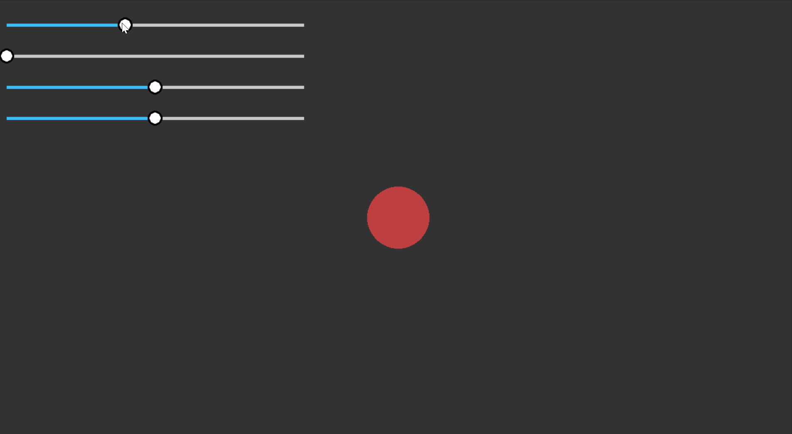

# Guipy


Pygame UI Library built by Casey (@caseyhackerman) and Jason

## Installation
```
pip install guipylib
```
or with poetry
```
poetry add guipylib
```

## Example
<p align="center">

</p>


```python
import sys
import colorsys

from guipy.manager import GUIManager
from guipy.components.slider import Slider

import pygame 

pygame.init()

winW = 1280
winH = 720

root = pygame.display.set_mode((winW, winH))

man = GUIManager()

mySlider = Slider(height=50, width=500, thickness=5,
                    radius=12, initial_val=.4)
mySlider2 = Slider(height=50, width=500, thickness=5,
                    radius=12, initial_val=0)
mySlider3 = Slider(height=50, width=500, thickness=5,
                    radius=12, initial_val=.5)
mySlider4 = Slider(height=50, width=500, thickness=5,
                    radius=12, initial_val=.5)

man.add(mySlider, (0, 25))
man.add(mySlider2, (0, 75))
man.add(mySlider3, (0, 125))
man.add(mySlider4, (0, 175))

while True:
    for event in pygame.event.get():
        if event.type == pygame.QUIT:
            sys.exit()

    root.fill((50, 50, 50))

    color = tuple(i * 255 for i in colorsys.hls_to_rgb(mySlider2.get_val(),
                    mySlider3.get_val(), mySlider4.get_val()))

    pygame.draw.circle(root, color, (winW/2, winH/2),
                        10 + mySlider.get_val() * 100)

    man.draw(root)
    man.update(pygame.mouse.get_pos())
    pygame.display.update()

```

## Documentation
Check out some helpful guides and API references [here](https://zjjc123.github.io/guipy/)